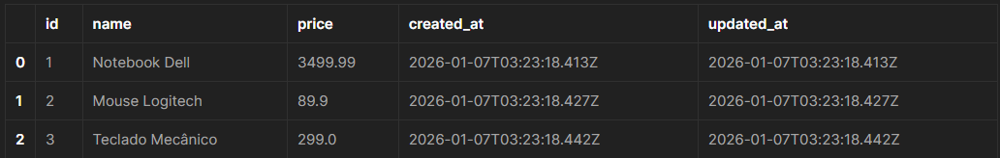
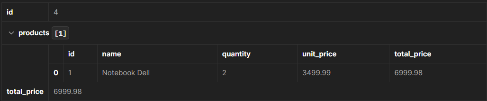
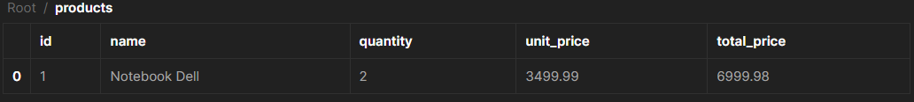
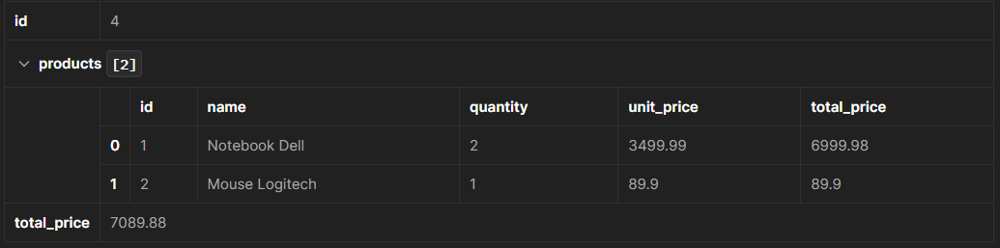

# API Carrinho de Compras - Tech Interview

API REST para gerenciamento de carrinho de compras de e-commerce desenvolvida em Ruby on Rails.

## Tecnologias

- Ruby 3.3.1
- Rails 7.1.3.2
- PostgreSQL 16
- Redis 7.0.15
- Sidekiq

## Funcionalidades

- Adicionar produtos ao carrinho
- Listar produtos do carrinho
- Alterar quantidade de produtos
- Remover produtos do carrinho
- Job automático para gerenciar carrinhos abandonados (após 3 horas de inatividade)
- Remoção automática de carrinhos abandonados há mais de 7 dias

## Instalação

### Pré-requisitos

- Ruby 3.3.1
- PostgreSQL 16
- Redis 7.0.15
- Bundler

### Setup

bundle install
rails db:create
rails db:migrate
rails db:seed

## Executando a Aplicação

### Sem Docker

Terminal 1 - Redis
redis-server

Terminal 2 - Sidekiq
bundle exec sidekiq

Terminal 3 - Rails
bundle exec rails server

### Com Docker

docker-compose build
docker-compose run web rails db:create db:migrate db:seed
docker-compose up

## Endpoints da API

### 1. Listar Produtos

GET /products

### 2. Adicionar Produto ao Carrinho

POST /cart
Content-Type: application/json

{
  "product_id": 1,
  "quantity": 2
}

Response 201:

{
  "id": 1,
  "products": [
    {
      "id": 1,
      "name": "Notebook Dell",
      "quantity": 2,
      "unit_price": 3499.99,
      "total_price": 6999.98
    }
  ],
  "total_price": 6999.98
}

### 3. Visualizar Carrinho

GET /cart

### 4. Adicionar/Alterar Quantidade

POST /cart/add_item
Content-Type: application/json

{
  "product_id": 1,
  "quantity": 1
}

### 5. Remover Produto

DELETE /cart/:product_id

## 📸 Screenshots da API

### 1. Listar Produtos Disponíveis


### 2. Criar Carrinho e Adicionar Produto


### 3. Visualizar Carrinho Atual


### 4. Adicionar Mais Itens ao Carrinho


## Job de Carrinhos Abandonados

O sistema possui um job Sidekiq que executa a cada hora:

- Marca carrinhos sem interação há mais de 3 horas como abandonados
- Remove carrinhos abandonados há mais de 7 dias

Configuração em config/schedule.yml.

## Testes

bundle exec rspec

Cobertura: 30 testes, 0 falhas, 1 pending

## Estrutura do Projeto
```
app/
├── controllers/
│   └── carts_controller.rb
├── models/
│   ├── cart.rb
│   ├── cart_item.rb
│   └── product.rb
└── sidekiq/
    └── mark_cart_as_abandoned_job.rb

config/
├── initializers/
│   └── sidekiq.rb
└── schedule.yml

docs/
└── screenshots/
    ├── screenshot-1-produtos.png
    ├── screenshot-2-criar-carrinho.png
    ├── screenshot-3-ver-carrinho.png
    └── screenshot-4-adicionar-item.png

spec/
├── factories/
├── models/
├── requests/
└── sidekiq/
```
## Validações

- Quantidade de produtos deve ser maior que 0
- Produto deve existir no banco de dados
- Carrinho é criado automaticamente na primeira interação
- Session ID único por carrinho
- Atualização automática de last_interaction_at em cada operação

## Decisões Técnicas

- Uso de session_id para persistência do carrinho entre requisições
- Callbacks para atualização automática de timestamps
- Sidekiq-Cron para agendamento de jobs
- Factory Bot e Shoulda Matchers para testes mais limpos
- Separação de responsabilidades entre models e controllers

## Desenvolvido por

Evelyn Santos
Tech Interview - Backend Entry Level
Janeiro 2026
